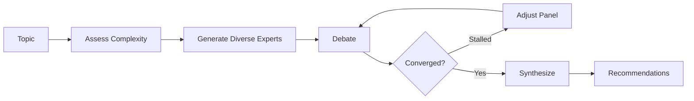

# panel-skill

Expert panel discussions for complex decisions. Claude becomes 3-7 domain experts who debate, challenge each other, and synthesize actionable recommendations.

## Install

```bash
npx skills add wyattowalsh/panel-skill
```

## Use

```bash
/panel "Should we migrate to microservices?"
/panel size:5 depth:deep "Build vs buy our CRM?"
/panel style:adversarial "GraphQL vs REST?"
```

## Example

```
╭─ Panel Discussion: Microservices Migration ───────────────╮
│ Experts: Dr. Chen (Security), Kai Lindström (Platform),   │
│          Rashida Okoye (Ops), Sophia Martinez (Product)   │
╰───────────────────────────────────────────────────────────╯

🎤 Dr. Chen (Security):
   "Each microservice becomes a potential entry point. We need
   zero-trust from day one."

🎤 Kai Lindström (Platform) [Contrarian]:
   "Before we assume microservices, has anyone considered a
   well-structured modular monolith? You get 80% of the benefits
   without the operational overhead."

🎤 Rashida Okoye (responding to Kai):
   "I've seen both approaches. With 15 engineers and only 3 with
   distributed systems experience, Kai's point is well-taken."

📋 Round 1 Synthesis:
   • Agreement: Team capability matters more than architecture choice
   • Tension: Invest in microservices now vs. extract services later
   • Open question: What are our actual scaling bottlenecks?
```

## How it works



The design is grounded in multi-agent debate research:

| Finding | Source | What we do |
|---------|--------|------------|
| Diversity drives quality | Wu et al. 2025 | Require contrarian + synthesizer + specialist |
| Majority pressure suppresses dissent | Wu et al. 2025 | Contrarian speaks before every synthesis |
| Debate helps complex tasks only | ICLR 2025 | Skip panel for simple questions |
| Confidence weighting improves accuracy | CISC 2025 | Weight by expertise + confidence |
| Detect convergence to stop early | Adaptive Stability 2025 | Early termination + stall detection |
| Dynamic composition beats static | A-HMAD 2025 | Mid-discussion panel adjustment |

## Options

```bash
/panel size:5 depth:deep "Build vs buy our CRM?"
```

| Option | Values | Default |
|--------|--------|---------|
| `size` | 3-7 | auto |
| `depth` | quick / standard / deep | standard |
| `style` | collaborative / adversarial | collaborative |

Low-complexity topics (e.g., "What port does PostgreSQL use?") trigger a warning before proceeding, as multi-agent debate is optimized for complex decision-making.

## Documentation

- [SKILL.md](SKILL.md) — Full skill definition
- [references/](references/) — Expert generation, synthesis patterns, output formats
- [examples/](examples/) — Sample discussions

## License

MIT
