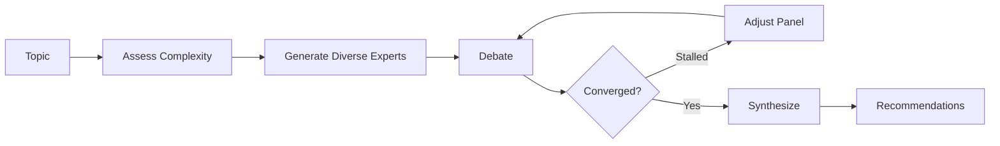

# panel-skill

Expert panel discussions for complex decisions. Claude becomes 3-7 domain experts who debate, challenge each other, and synthesize actionable recommendations.

## Install

```bash
npx skills add wyattowalsh/panel-skill
```

## Usage

```bash
/panel "Should we migrate to microservices?"
/panel size:5 depth:deep "Build vs buy our CRM?"
/panel style:adversarial "GraphQL vs REST?"
```

### Options

| Option | Values | Default |
|--------|--------|---------|
| `size` | 3-7 | auto (based on topic breadth) |
| `depth` | quick / standard / deep | standard |
| `style` | collaborative / adversarial / academic | collaborative |

## Example

```
╭─ Panel Discussion: Microservices Migration ───────────────╮
│ Experts: Dr. Chen (Security), Kai Lindström (Platform),   │
│          Rashida Okoye (Ops), Sophia Martinez (Product)   │
╰───────────────────────────────────────────────────────────╯

🎤 Dr. Chen (Security):
   "Each microservice becomes a potential entry point. We need
   zero-trust from day one."

🎤 Kai Lindström (Platform) [Contrarian]:
   "Before we assume microservices, has anyone considered a
   well-structured modular monolith? You get 80% of the benefits
   without the operational overhead."

🎤 Rashida Okoye (responding to Kai):
   "I've seen both approaches. With 15 engineers and only 3 with
   distributed systems experience, Kai's point is well-taken."

📋 Round 1 Synthesis:
   • Agreement: Team capability matters more than architecture choice
   • Tension: Invest in microservices now vs. extract services later
   • Open question: What are our actual scaling bottlenecks?
```

## How It Works



The skill screens low-complexity topics (e.g., "What port does PostgreSQL use?") with a warning, since multi-agent debate adds overhead without benefit for simple questions.

---

## Research Foundations

This skill is grounded in peer-reviewed multi-agent debate research. The design synthesizes findings from multiple 2024-2025 publications into actionable principles.

### Core Findings

| Finding | Source | Implementation |
|---------|--------|----------------|
| Diversity is the dominant driver of debate quality | [Wu et al. 2025](https://arxiv.org/abs/2511.07784) | Diversity score ≥60 required before proceeding |
| Majority pressure suppresses independent correction | [Wu et al. 2025](https://arxiv.org/abs/2511.07784) | Contrarian protection protocol |
| Heterogeneous agents outperform homogeneous | [A-HMAD 2025](https://link.springer.com/article/10.1007/s44443-025-00353-3) | Max 30% same-archetype rule |
| MAD helps complex tasks, not simple ones | [ICLR 2025 Analysis](https://d2jud02ci9yv69.cloudfront.net/2025-04-28-mad-159/blog/mad/) | Complexity classifier (5-15 scale) |
| Confidence weighting improves synthesis | [CISC, ACL 2025](https://aclanthology.org/2025.findings-acl.1030/) | Weight positions by expertise + confidence |
| 3 agents × 2 rounds is effective baseline | [Du et al. ICML 2024](https://arxiv.org/abs/2305.14325) | Default: 4-5 experts, 2-3 rounds |
| Stability detection improves stopping | [Adaptive MAD 2025](https://arxiv.org/abs/2510.12697) | Early termination + stall detection |
| Dynamic composition beats static | [A-HMAD 2025](https://link.springer.com/article/10.1007/s44443-025-00353-3) | Mid-discussion panel adjustment |

### Key Research

#### Du et al. (ICML 2024) — "Improving Factuality and Reasoning through Multiagent Debate"

The foundational paper establishing that multiple LLM instances debating over rounds significantly improves reasoning. Key findings:
- Cross-examination reduces hallucinations
- Performance scales with agent count and debate rounds
- 3 agents × 2 rounds is a cost-effective baseline

**Link**: https://arxiv.org/abs/2305.14325

#### Wu et al. (Nov 2025) — "Can LLM Agents Really Debate?"

Critical analysis revealing that **group diversity is THE dominant driver** of debate quality—more important than structural parameters like speaking order or confidence visibility. Also found that majority pressure suppresses correction, leading to conformity cascades.

**Implementation**: Required diversity scoring, contrarian protection protocol, explicit dissent solicitation before synthesis.

**Link**: https://arxiv.org/abs/2511.07784

#### A-HMAD (Nov 2025) — Adaptive Heterogeneous Multi-Agent Debate

Demonstrates that heterogeneous specialized agents significantly outperform homogeneous teams. Simple majority voting underperforms quality-weighted aggregation.

**Implementation**: Mandatory archetype heterogeneity (Contrarian + Synthesizer + Specialist), no more than 30% same-archetype, adaptive moderation.

**Link**: https://link.springer.com/article/10.1007/s44443-025-00353-3

#### CISC (ACL 2025) — Confidence Improves Self-Consistency

Shows that prioritizing high-confidence reasoning paths reduces required samples by 40%+ while maintaining accuracy. Confidence signals correlate with correctness.

**Implementation**: Expert confidence signals (high/medium/low), domain expertise weighting, confidence-weighted synthesis.

**Link**: https://aclanthology.org/2025.findings-acl.1030/

### Anti-Patterns Avoided

Research identifies failure modes that this skill actively prevents:

1. **Conformity Cascade** — LLMs tend toward majority positions, entrenching early errors.
   *Mitigation*: Required contrarian, explicit disagreement triggers.

2. **Devil's Advocate Overuse** — Pure adversarial debate reduces accuracy.
   *Mitigation*: Synthesizer required, ~90% collaborative tone.

3. **False Consensus** — Averaging positions loses nuance.
   *Mitigation*: Context-dependent synthesis, "CONTESTED" labeling when warranted.

4. **Overhead on Simple Tasks** — MAD adds cost without benefit on easy questions.
   *Mitigation*: Complexity classifier screens topics before spawning panel.

### Philosophical Foundations

The synthesis mechanism uses **Hegelian dialectic**:
- **Thesis**: Initial expert position
- **Antithesis**: Challenging perspective
- **Synthesis**: Higher-order integration (not compromise, but emergence)

Each round's synthesis becomes the next round's thesis, enabling progressive refinement.

---

## Architecture

```
panel-skill/
├── SKILL.md              # Execution instructions for Claude (~150 lines)
├── references/           # Deep-dive documentation
│   ├── research-foundations.md
│   ├── expert-generation.md
│   ├── turn-taking.md
│   ├── synthesis-patterns.md
│   └── output-formats.md
└── examples/             # Sample discussions
```

The skill follows **progressive disclosure**: SKILL.md contains lean execution logic; reference files provide depth when needed.

## License

MIT
