<div align="center">

# panel-debate-skill

**Expert panel discussions for complex decisions**

Claude becomes 3-7 domain experts who debate, challenge each other, and synthesize actionable recommendations through [Hegelian dialectic](#philosophical-foundations).

[](LICENSE)
[](#research-foundations)

[Install](#install) • [Usage](#usage) • [How It Works](#how-it-works) • [Research](#research-foundations)

</div>

---

## Install

```bash
npx skills add wyattowalsh/panel-debate-skill
```

> [!TIP]
> After installation, the `/panel-debate` command becomes available in Claude Code.

## Usage

```bash
/panel-debate "Should we migrate to microservices?"
/panel-debate size:5 depth:deep "Build vs buy our CRM?"
/panel-debate style:adversarial "GraphQL vs REST?"
```

### Options

| Option | Values | Default | Description |
|:-------|:-------|:--------|:------------|
| `size` | `3`-`7` | auto | Number of experts (auto-scales with topic breadth) |
| `depth` | `quick` / `standard` / `deep` | `standard` | Discussion rounds: 1 / 2-3 / 4+ |
| `style` | `collaborative` / `adversarial` / `academic` | `collaborative` | Panel interaction tone |

> [!NOTE]
> Low-complexity topics (e.g., "What port does PostgreSQL use?") trigger a warning—multi-agent debate adds overhead without benefit for simple questions.

---

## Example Output

<details open>
<summary><strong>📋 Microservices Migration Panel</strong></summary>

```
╭─ Panel Discussion: Microservices Migration ───────────────╮
│ Experts: Dr. Chen (Security), Kai Lindström (Platform),   │
│          Rashida Okoye (Ops), Sophia Martinez (Product)   │
╰───────────────────────────────────────────────────────────╯

🎤 Dr. Chen (Security):
   "Each microservice becomes a potential entry point. We need
   zero-trust from day one."

🎤 Kai Lindström (Platform) [Contrarian]:
   "Before we assume microservices, has anyone considered a
   well-structured modular monolith? You get 80% of the benefits
   without the operational overhead."

🎤 Rashida Okoye (responding to Kai):
   "I've seen both approaches. With 15 engineers and only 3 with
   distributed systems experience, Kai's point is well-taken."

📋 Round 1 Synthesis:
   • Agreement: Team capability matters more than architecture choice
   • Tension: Invest in microservices now vs. extract services later
   • Open question: What are our actual scaling bottlenecks?

╭───────────────────────────────────────────────────────────╮
│ [1] Continue  [2] Follow-up  [3] Redirect  [4] Conclude   │
╰───────────────────────────────────────────────────────────╯
```

</details>

---

## How It Works

```mermaid
flowchart TB
    subgraph Input
        A[🎯 Topic]
    end

    subgraph Validation
        B{Complexity<br/>Score}
        B -->|5-7: Low| C[⚠️ Warn User]
        C --> D{Proceed?}
        D -->|No| E[Direct Answer]
        D -->|Yes| F
        B -->|8-15| F[✓ Continue]
    end

    subgraph Panel["Panel Assembly"]
        F --> G[Generate Experts]
        G --> H{Diversity<br/>≥60?}
        H -->|No| G
        H -->|Yes| I[🎭 Panel Ready]
    end

    subgraph Discussion
        I --> J[Round N]
        J --> K[Cross-Examination]
        K --> L[🛡️ Contrarian Check]
        L --> M[📋 Synthesis]
        M --> N{Converged?}
        N -->|No| O{Stalled?}
        O -->|Yes| P[Adjust Panel]
        P --> J
        O -->|No| J
    end

    subgraph Output
        N -->|Yes| Q[📊 Final Report]
    end

    A --> B
```



### State Machine

| State | Description | Exit Condition |
|:------|:------------|:---------------|
| `COMPLEXITY_CHECK` | Assess if topic warrants panel | Score calculated |
| `EXPERT_GENERATION` | Create diverse personas | Diversity ≥60 |
| `DISCUSSION` | Facilitate debate rounds | Convergence or max rounds |
| `SYNTHESIS` | Generate recommendations | Report complete |

> [!IMPORTANT]
> Every panel **must** include three archetypes: **Contrarian** (challenges consensus), **Synthesizer** (connects perspectives), and **Specialist** (provides domain depth).

---

## Research Foundations

This skill synthesizes findings from peer-reviewed multi-agent debate research[^1].

### Core Findings

| Finding | Source | Implementation |
|:--------|:-------|:---------------|
| Diversity is THE dominant driver | Wu et al. 2025[^2] | Diversity score ≥60 required |
| Majority pressure suppresses correction | Wu et al. 2025[^2] | Contrarian protection protocol |
| Heterogeneous > homogeneous agents | A-HMAD 2025[^3] | Max 30% same-archetype |
| MAD helps complex, not simple tasks | ICLR 2025[^4] | Complexity classifier |
| Confidence weighting improves synthesis | CISC 2025[^5] | Weighted aggregation |
| 3 agents × 2 rounds is effective | Du et al. 2024[^6] | Default configuration |

<details>
<summary><strong>📚 Detailed Research Summaries</strong></summary>

#### Du et al. (ICML 2024)
> "Improving Factuality and Reasoning through Multiagent Debate"

The foundational paper establishing that multiple LLM instances debating over rounds significantly improves reasoning:
- Cross-examination reduces hallucinations
- Performance scales with agent count and rounds
- 3 agents × 2 rounds is cost-effective baseline

#### Wu et al. (Nov 2025)
> "Can LLM Agents Really Debate?"

Critical analysis revealing **group diversity is THE dominant driver**—more important than speaking order or confidence visibility. Majority pressure suppresses correction, leading to conformity cascades.

#### A-HMAD (Nov 2025)
> Adaptive Heterogeneous Multi-Agent Debate

Heterogeneous specialized agents significantly outperform homogeneous teams. Simple majority voting underperforms quality-weighted aggregation.

#### CISC (ACL 2025)
> Confidence Improves Self-Consistency

Prioritizing high-confidence reasoning paths reduces required samples by 40%+ while maintaining accuracy.

</details>

### Anti-Patterns Avoided

> [!CAUTION]
> Research identifies these failure modes—panel-debate-skill actively prevents them:

| Anti-Pattern | Problem | Mitigation |
|:-------------|:--------|:-----------|
| **Conformity Cascade** | LLMs drift toward majority, entrenching errors | Required contrarian + disagreement triggers |
| **Devil's Advocate Overuse** | Pure adversarial debate reduces accuracy | Synthesizer required, ~90% collaborative |
| **False Consensus** | Averaging positions loses nuance | Context-dependent synthesis, "CONTESTED" labels |
| **Simple Task Overhead** | MAD adds cost without benefit | Complexity classifier screens topics |

### Philosophical Foundations

The synthesis mechanism uses **Hegelian dialectic**:


Each round's synthesis becomes the next round's thesis, enabling **progressive refinement** rather than simple compromise.

---

## Architecture

```
panel-debate-skill/
├── SKILL.md              # Entry point (~150 lines)
├── AGENTS.md             # AI agent instructions
├── CLAUDE.md             # → symlink to AGENTS.md
├── references/
│   ├── research-foundations.md
│   ├── expert-generation.md
│   ├── turn-taking.md
│   ├── synthesis-patterns.md
│   └── output-formats.md
└── examples/
    ├── architecture-decision.md
    ├── business-strategy.md
    └── security-implementation.md
```

> [!NOTE]
> The skill uses **progressive disclosure**: `SKILL.md` contains lean execution logic; reference files are loaded on-demand for depth.

---

## Contributing

See [CONTRIBUTING.md](.github/CONTRIBUTING.md) for guidelines.

<details>
<summary><strong>Quick Test Commands</strong></summary>

```bash
# Install locally
npx skills add ./

# Test complexity rejection
/panel-debate "What port does PostgreSQL use?"

# Test standard panel
/panel-debate "Redis vs Memcached?"

# Test deep panel
/panel-debate depth:deep "Microservices migration strategy"
```

</details>

---

## License

[MIT](LICENSE)

---

[^1]: Full citations in [references/research-foundations.md](references/research-foundations.md)
[^2]: Wu et al. "Can LLM Agents Really Debate?" [arXiv:2511.07784](https://arxiv.org/abs/2511.07784)
[^3]: A-HMAD "Adaptive Heterogeneous Multi-Agent Debate" [Springer](https://link.springer.com/article/10.1007/s44443-025-00353-3)
[^4]: ICLR 2025 MAD Analysis [Blog](https://d2jud02ci9yv69.cloudfront.net/2025-04-28-mad-159/blog/mad/)
[^5]: CISC "Confidence Improves Self-Consistency" [ACL 2025](https://aclanthology.org/2025.findings-acl.1030/)
[^6]: Du et al. "Improving Factuality through Multiagent Debate" [arXiv:2305.14325](https://arxiv.org/abs/2305.14325)
